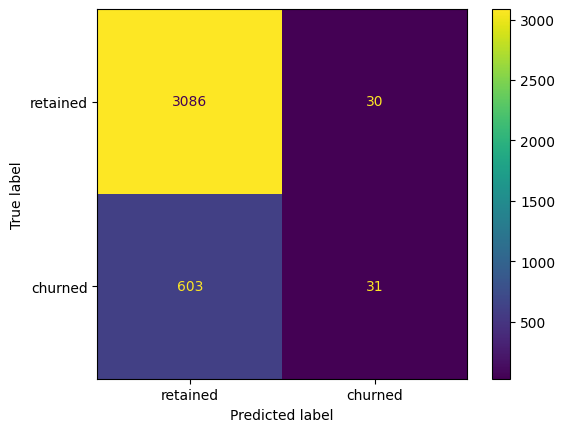
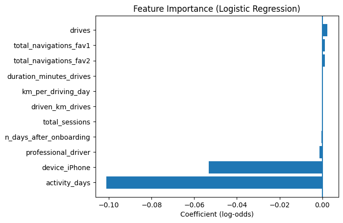

# Predicting-User-Churn-Using-Logistic-Regression
This is the final project of course 5 of Google's Advanced Data Analytics Certificate

## Introduction 
The Waze data team was tasked with analyzing user behavioral patterns in order to understand tendancies to churn. This will improve overall user experience and platform growth. Retaining the users currently using the app is fundamental to the long-term success of Waze.

## Objective
### Target Goal
Develop a logistic regession model to accurately classify whether a user is at risk of churning. 

### Impact
Focusing development and marketing efforts on features that strengthen loyalty rather than contribute to churn.

### Methods
* Analyzed patterns at a high level to familiarize with the data
* Checked for proabability linearity and multicollinearity 
* Evaluated perfomance metrics 
* Constructed a heat map for checking false positives and negatives
* 
## Next Steps
* Variable Expansion – Explore additional factors (e.g., navigation to favorites, onboarding time, geographic location/traffic conditions) to determine stronger churn predictors. More specifically, there is not as high of a correlation to driving minutes and driven km as one might expect. This may prove useful to be investigated.
* Analyze Device Software – Explore differences in iPhone and Adroid user experience to discover why the device type contributes heavily to user churn.

